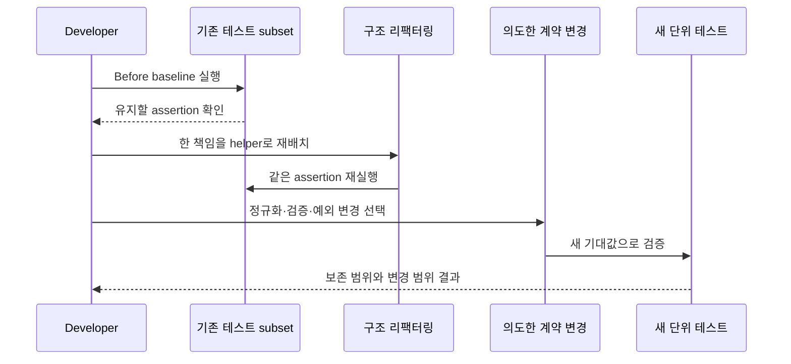

<a id="seq-11"></a>

# 리팩토링과 기초 보강 이론

## 1. 구조 변경과 동작 보강을 한 기준으로 판단하지 않습니다

이번 시퀀스에는 서로 다른 두 작업이 함께 있습니다.

- 구조 리팩터링 lane은 이미 테스트가 단언한 반환 값과 예외 중 그대로 유지하기로 한 범위만 보호합니다.
- 동작 보강 lane은 공백 정리, 서비스 검증, 설명적인 예외처럼 의도적으로 바꿀 계약을 새 테스트로 명시합니다. `update`의 명시적 저장 호출은 목표 코드에서 따로 확인합니다.

따라서 모든 입력, 반환 값, 예외가 Before와 같아야 한다고 말할 수 없습니다. `findPostById`와 `validateAuthor`도 실습 시작 코드에 이미 있으므로 새로 추출할 핵심으로 보지 않습니다.



| 단계 | 들어온 것 | 한 일 | 나간 것 또는 상태 |
|---|---|---|---|
| 1 | 실습 시작 코드와 기존 테스트 | 기존 assertion을 읽고 baseline 실행 | 유지할 동작 subset |
| 2 | 혼합된 Service 본문 | 한 책임을 이름 있는 helper로 재배치 | 구조 변경 후보 |
| 3 | 같은 입력과 mock 조건 | 기존 테스트 재실행 | 유지 subset 통과 또는 회귀 |
| 4 | 공백·누락 사용자 같은 새 조건 | 의도한 계약 변경을 선택 | 새 기대값 |
| 5 | 새 기대값 | 정규화·검증·예외 테스트 추가 | 동작 보강 증거 |
| 6 | 두 lane의 결과 | 구조 회귀와 의도한 차이를 분리 | 완료 또는 첫 실패 경계 |

## 2. 시작 코드는 create 책임을 한 본문에서 수행합니다

실습 시작 `PostService.create`는 entity 생성, 저장, 응답 변환을 한 메서드에서 순서대로 수행합니다.

```kotlin
val savedPost = postRepository.save(
    PostEntity(
        title = request.title,
        content = request.content,
        author = authorEmail
    )
)
return PostResponse.from(savedPost)
```

이 본문을 orchestration과 helper 책임으로 나눌 수 있습니다. 다만 title·content·author를 `trim`하고 blank를 거부하면 단순 이동이 아니라 입력 계약도 달라집니다. 구조 차이와 값 차이를 같은 ‘동작 보존’으로 숨기지 않습니다.

## 3. 실제 테스트 범위로 두 lane을 나눕니다

구조 리팩터링 뒤에도 기존 assertion이 보호하는 다음 범위는 유지합니다.

- 이미 정리된 create 요청의 id, title, content, author 반환
- 없는 게시글 id의 `PostNotFoundException`
- 올바른 login 입력의 access token 생성
- 잘못된 password의 `InvalidCredentialsException`

다음 항목은 새 기대값을 추가하는 동작 보강입니다.

- sign-up email을 trim·lowercase한 뒤 저장하고 중복 email을 거부
- 공백뿐인 게시글 field를 `InvalidPostRequestException`으로 거부
- update title·content를 trim한 반환값을 확인
- 없는 현재 사용자를 `InvalidCredentialsException` 대신 `UserNotFoundException`으로 구분

완성 목표의 `update`는 `postRepository.save(post)`를 명시적으로 호출합니다. 하지만 현재 단위 테스트는 이 호출을 stubbing할 뿐 `verify`하지 않으므로, 테스트가 저장 호출까지 증명한다고 말하지 않습니다. 저장 호출은 코드에서 확인하고 테스트 증거는 trim된 Service 반환값까지로 한정합니다.

마지막 항목은 Service 예외 타입뿐 아니라 handler의 목표 HTTP status도 401에서 404로 달라집니다. 이는 구조 lane에서 유지할 응답이 아니라 의도한 계약 변경입니다. 현재 단위 테스트는 `UserNotFoundException`만 확인하며, 실제 HTTP status와 body는 별도 web 검증 없이는 증명됐다고 확대하지 않습니다.

## 4. 실패 결과도 lane에 맞춰 읽습니다

- 유지하기로 한 기존 assertion이 실패하면 마지막 구조 재배치에서 인자, 반환 값, collaborator 조건을 확인합니다.
- 새 정규화·검증 테스트가 실패하면 구현이 새 계약에 도달하지 못한 것입니다. Before와 달라졌다는 이유만으로 회귀라고 부르지 않습니다.
- 예상하지 않은 반환 값이나 예외 차이는 두 작업이 섞였다는 신호이므로 변경을 더 작은 단위로 나눕니다.
- feature-based package 이동은 더 넓은 구조 변경이므로 현재 Service와 테스트 범위를 닫은 뒤 별도로 검토합니다.

```bash
./gradlew test
```

완료 조건은 ‘모든 것이 Before와 동일’이 아닙니다. 유지하기로 한 기존 assertion과 의도한 새 assertion을 각각 통과시키고, 테스트가 직접 검증하지 않는 명시적 저장 호출은 목표 코드에서 별도로 확인해야 합니다.

다음 시퀀스에서는 정리된 책임 위에서 요청 응답과 후속 이벤트 전달을 분리합니다.

[Visual Lab에서 입력 조건을 보고 경로 예측하기](./visual-lab/sequences/11/)
