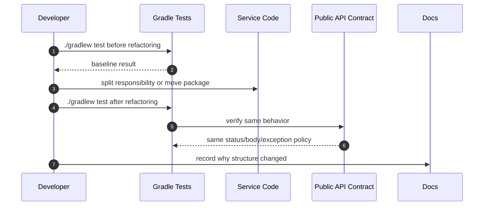
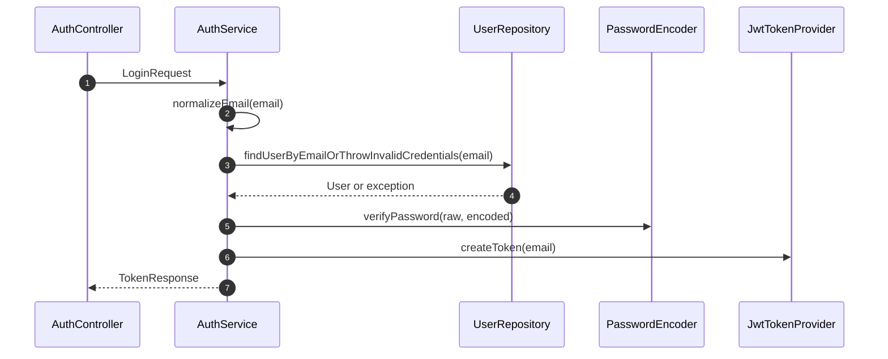
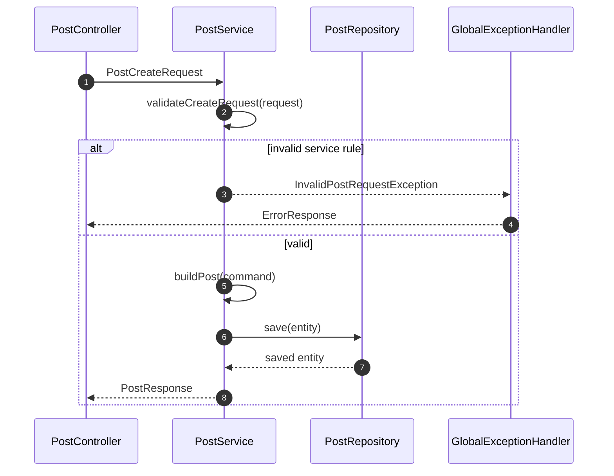
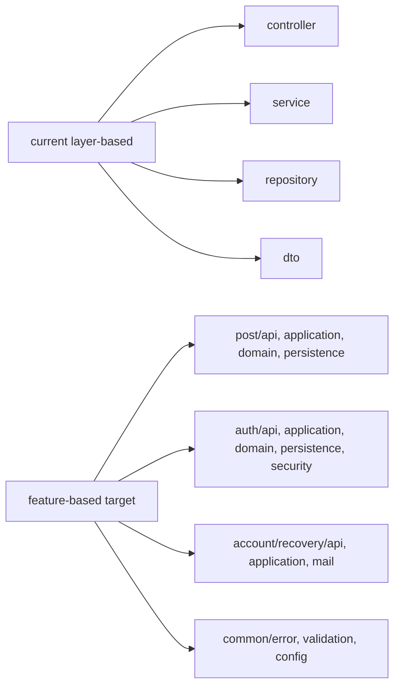

# 이론 정리

> 이번 시퀀스는 동작을 바꾸지 않고 구조를 더 읽기 좋게 만드는 리팩토링 기초 단계입니다.
> 이 브랜치에서는 `AuthService`, `PostService`, `GlobalExceptionHandler`, Service 테스트를 기준으로 책임 분리와 동작 보존을 비교합니다. feature-based 전환은 이 책임 경계를 바탕으로 이어지는 후속 선택지입니다.

## 1. Problem - 왜 리팩토링이 필요한가

기능이 늘어나면 새 기능을 만드는 시간만큼 기존 코드를 다시 읽고 바꾸는 시간이 늘어납니다. 처음에는 controller, service, repository처럼 layer별로 나누는 구조가 이해하기 좋지만, 기능이 쌓이면 한 기능을 수정하기 위해 여러 layer 폴더를 계속 오가야 합니다.

또한 한 service 메서드가 입력 정리, 조회, 검증, 저장, 응답 변환을 모두 갖고 있으면 수정 지점이 흐려집니다. 테스트 없이 구조를 바꾸면 API path, response body, status code가 그대로 유지되는지도 확인하기 어렵습니다.

정답 구현은 아래 문제를 다룹니다.

- 리팩토링과 기능 변경을 구분합니다.
- `AuthService`의 email 정리, 사용자 조회, 비밀번호 검증, token 응답 생성을 나눕니다.
- `PostService`의 필드 검증, entity 조작, 응답 변환을 나눕니다.
- service 검증 실패를 일관된 예외 응답으로 연결합니다.
- 테스트로 리팩토링 후에도 같은 동작이 유지되는지 확인합니다.

## 2. Analyze - 정답 구현에서 선택한 구조 기준

| 기준 | 정답 구현의 선택 | 이유 |
|---|---|---|
| 동작 보존 | `./gradlew test`로 전후 확인 | 리팩토링과 기능 변경을 구분합니다. |
| Auth 책임 | normalize, find, verify, response 생성 분리 | 로그인 실패 원인과 수정 지점이 분명해집니다. |
| Post 책임 | validate, build/apply, toResponse 분리 | 생성/수정 흐름의 공통 규칙을 설명하기 쉽습니다. |
| 예외 응답 | service 예외를 `ErrorResponse`로 변환 | 실패 응답 구조를 일관되게 유지합니다. |
| feature-based 전환 | 기능별 package 경계를 목표로 둠 | 향후 변경 파일을 가까이 둘 기준을 마련합니다. |

정답 구현의 직접 범위는 helper 메서드와 검증/예외/테스트 보강입니다. feature-based package 이동은 같은 테스트 안전망을 세운 뒤 검토할 후속 선택지입니다.

## 3. API / 실행 시퀀스 다이어그램

### 3.1 리팩토링 전후 검증 흐름

정답 구현은 구조를 나눈 뒤 테스트가 계속 통과하는지 확인합니다. 테스트가 없다면 리팩토링 후 기능 보존을 주장하기 어렵습니다.

### 3.2 AuthService 책임 분리 흐름

한 메서드 안에서 모두 처리할 수도 있지만, 책임을 나누면 실패 위치와 변경 지점이 더 분명해집니다.

### 3.3 PostService 검증과 예외 응답 흐름

service 검증은 DTO 검증을 대체하지 않습니다. controller를 지나지 않는 내부 호출과 테스트에서도 핵심 규칙을 유지하기 위한 방어선입니다.

## 4. 계층 / DTO / 메시지 흐름

### 4.1 layer-based에서 feature-based로 보는 관점

| 관점 | 장점 | 위험 |
|---|---|---|
| layer-based | 입문 단계에서 기술 역할을 이해하기 좋습니다. | 한 기능 수정 시 여러 layer 폴더를 오가게 됩니다. |
| feature-based | 기능 변경 파일을 가까이 둘 수 있습니다. | feature 경계와 common 기준이 흐리면 구조가 더 복잡해집니다. |

### 4.2 DTO와 책임 흐름

| 흐름 | 입력 DTO | Service 내부 경계 | 출력/실패 |
|---|---|---|---|
| 회원가입 | `UserSignUpRequest` | normalize, 중복 확인, local user 생성 | 저장 완료 또는 conflict |
| 로그인 | `LoginRequest` | normalize, 조회, password 검증 | `TokenResponse` 또는 인증 실패 |
| 게시글 생성 | `PostCreateRequest` | field 검증, command 생성, entity build | `PostResponse` 또는 검증 실패 |
| 게시글 수정 | `PostUpdateRequest` | 조회, field 검증, entity apply | `PostResponse` 또는 예외 |
| 실패 응답 | 예외 | handler 변환 | `ErrorResponse` |

## 5. Action - 정답 구현에서 비교할 코드 흐름

### 5.1 AuthService

정답 구현은 로그인 흐름을 email 정리, 사용자 조회, password 검증, token 응답 생성으로 나눕니다.

비교 포인트:

- `normalizeEmail(...)`이 email 처리 기준을 한곳에 모으나요?
- 조회 실패와 password 불일치가 같은 인증 실패 정책으로 이어지나요?
- token 생성이 별도 응답 생성 흐름으로 분리되어 있나요?

### 5.2 PostService

정답 구현은 게시글 생성/수정에서 필드 검증, command 생성, entity 조작, response 변환을 나눕니다.

비교 포인트:

- create/update가 같은 필드 검증 기준을 공유하나요?
- `PostCommand`가 service 내부 command로만 쓰이나요?
- `toResponse(...)`가 응답 변환 책임을 한곳에 모으나요?

### 5.3 GlobalExceptionHandler와 테스트

정답 구현은 새 service 예외를 `GlobalExceptionHandler`에서 공통 `ErrorResponse`로 변환합니다. 테스트는 리팩토링 후에도 성공/실패 흐름을 보호합니다.

비교 포인트:

- `InvalidPostRequestException`이 400 응답과 errors map으로 이어지나요?
- 테스트가 helper 메서드 자체보다 외부 동작을 검증하나요?
- 리팩토링 후에도 기존 API 계약이 유지되나요?

## 6. Result - 확인할 결과와 남은 한계

정답 구현 기준으로 아래를 확인합니다.

- 로그인 흐름의 책임 경계가 분리됩니다.
- 게시글 생성/수정의 검증과 변환 기준이 분리됩니다.
- service 예외가 일관된 error response로 변환됩니다.
- 테스트가 리팩토링 후 동작 보존을 확인합니다.
- feature-based 전환을 위한 책임 경계 기준을 설명할 수 있습니다.

남는 한계도 함께 봅니다.

- 현재 정답 구현은 대규모 feature package 이동보다 service 책임 분리에 집중합니다.
- package 이동은 같은 테스트 안전망 아래에서 작은 단위로 이어가야 합니다.
- 이벤트 기반 구조는 다음 시퀀스에서 별도 사고 방식으로 다룹니다.

## 7. 실무 포인트

- 리팩토링은 코드 미화가 아니라 다음 변경 비용을 낮추는 작업입니다.
- 구조 변경과 기능 변경을 같은 commit에 섞으면 실패 원인을 찾기 어렵습니다.
- helper 메서드 수가 늘었다고 항상 좋은 리팩토링은 아닙니다. 책임 경계가 선명해야 합니다.
- `common`은 남는 파일을 넣는 곳이 아니라 여러 feature가 공유하는 명확한 책임만 두는 곳입니다.
- 테스트는 리팩토링을 허락하는 근거입니다.
- 문서는 “무엇을 바꿨는가”보다 “왜 이 경계로 나눴는가”를 남겨야 합니다.

## 8. 용어 정리

### Refactoring

- 뜻
  외부 동작은 유지하면서 내부 구조를 개선하는 작업입니다.
- 왜 중요한가
  다음 변경 때 수정 지점을 더 빨리 찾고 위험을 줄입니다.
- 이번 코드에서는 어디에 보이는가
  `AuthService.kt`, `PostService.kt`, `GlobalExceptionHandler.kt`
- 짧은 상황 예시
  로그인 결과는 같게 유지하면서 email 정리, 사용자 조회, 비밀번호 검증을 나눕니다.

### Feature-based Structure

- 뜻
  post, auth, account/recovery처럼 기능 단위로 파일을 가까이 두는 구조입니다.
- 왜 중요한가
  한 기능을 수정할 때 관련 파일을 함께 찾기 쉽습니다.
- 이번 코드에서는 어디에 보이는가
  중앙 커리큘럼의 전환 목표와 package 이동 기준
- 짧은 상황 예시
  게시글 기능은 `post/api`, `post/application`, `post/domain`, `post/persistence`로 모을 수 있습니다.

### Service Validation

- 뜻
  HTTP DTO 검증과 별개로 service 내부에서 비즈니스 규칙을 확인하는 것입니다.
- 왜 중요한가
  service는 controller 밖에서도 호출될 수 있기 때문입니다.
- 이번 코드에서는 어디에 보이는가
  `PostService.validatePostFields(...)`, `AuthService.verifyPassword(...)`
- 짧은 상황 예시
  테스트에서 controller를 거치지 않고 service를 직접 호출해도 공백 입력이 막혀야 합니다.

### Command Object

- 뜻
  service 내부에서 다음 단계로 넘길 정리된 입력값입니다.
- 왜 중요한가
  요청 DTO를 그대로 내부 전 단계에 흘리지 않고, 검증된 값만 사용하게 합니다.
- 이번 코드에서는 어디에 보이는가
  `PostService.PostCommand`
- 짧은 상황 예시
  `PostCreateRequest`를 검증한 뒤 `PostCommand`로 바꿔 entity 생성에 사용합니다.

### ErrorResponse

- 뜻
  실패 상황을 클라이언트가 읽을 수 있는 공통 응답 형태로 정리한 DTO입니다.
- 왜 중요한가
  예외마다 응답 형식이 달라지면 테스트와 클라이언트 처리가 어려워집니다.
- 이번 코드에서는 어디에 보이는가
  `ErrorResponse.kt`, `GlobalExceptionHandler.kt`
- 짧은 상황 예시
  service 검증 실패가 400 응답과 errors map으로 변환됩니다.

## 9. 다음 구현으로 연결되는 지점

`docs/implementation.md`와 `docs/checklist.md`를 볼 때는 helper 메서드의 개수보다 책임 경계, 테스트 보호 범위, 예외 응답 일관성을 먼저 봅니다. 다음 이벤트 기반 시퀀스에서는 이 구조 위에 요청/응답과 이벤트 흐름을 분리하는 사고를 더합니다.

멘토용 설명 포인트

- helper 메서드가 많아지는 것 자체가 목표는 아니며, 책임 경계가 선명해지는지가 기준입니다.
- 후속 선택지인 feature-based 전환과 현재 브랜치의 service 책임 분리 작업을 혼동하지 않게 구분합니다.
- 서비스 검증은 DTO 검증을 대체하는 것이 아니라 핵심 비즈니스 흐름을 한 번 더 방어하는 장치입니다.
- answer 비교 시 코드 길이보다 수정 지점이 빨리 보이는지 질문합니다.

