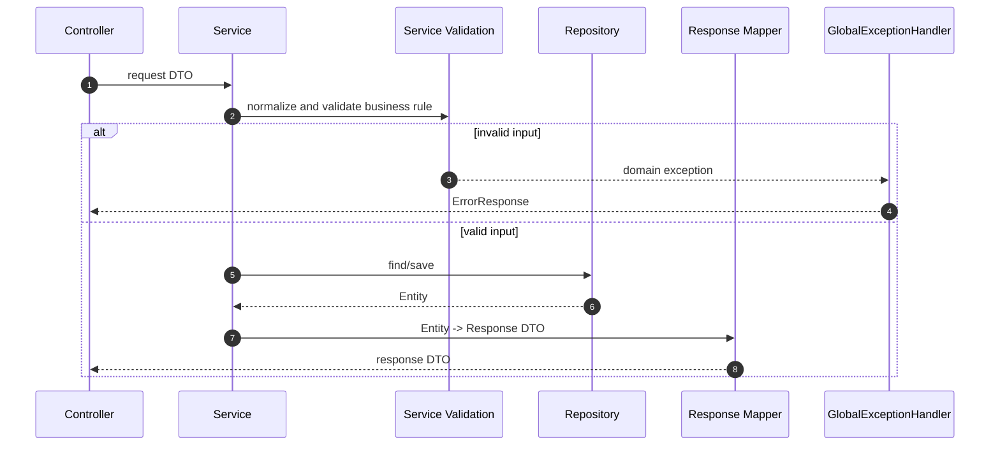
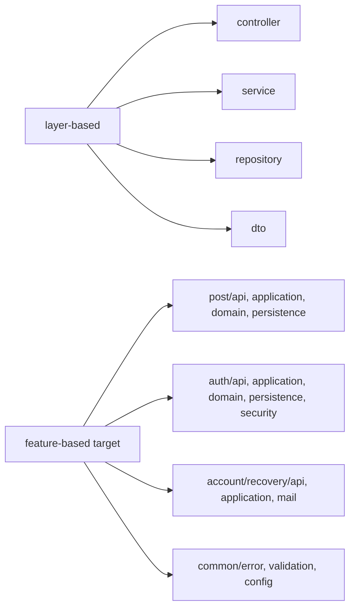

# 이론 정리

> 이번 시퀀스는 동작을 바꾸지 않고 구조를 더 읽기 좋게 만드는 리팩토링 기초 단계입니다.
> 중앙 커리큘럼은 feature-based 구조 전환까지 목표로 두지만, 현재 브랜치의 직접 작업 지점은 `AuthService`, `PostService`, `GlobalExceptionHandler`, Service 테스트를 통해 책임 경계와 동작 보존 기준을 잡는 것입니다.

## 1. Problem - 왜 리팩토링이 필요한가

기능이 늘어나면 새 기능을 만드는 시간만큼 기존 코드를 다시 읽고 바꾸는 시간이 늘어납니다. 처음에는 controller, service, repository처럼 layer별로 나누는 구조가 이해하기 쉽지만, 기능이 쌓이면 한 기능을 수정하기 위해 여러 layer 폴더를 계속 오가야 합니다.

또한 한 service 메서드가 입력 정리, 조회, 검증, 저장, 응답 변환을 모두 갖고 있으면 수정 지점이 흐려집니다. 테스트 없이 구조를 바꾸면 API path, response body, status code가 그대로 유지되는지도 확인하기 어렵습니다.

이번 시퀀스의 문제는 아래와 같습니다.

- 리팩토링과 기능 변경을 구분합니다.
- layer-based 구조와 feature-based 구조의 장단점을 비교합니다.
- Service 안에서 섞인 책임을 찾습니다.
- DTO 검증과 service 검증의 역할 차이를 봅니다.
- 테스트로 리팩토링 전후 동작 보존을 확인합니다.

## 2. Analyze - 어떤 구조 기준을 볼 것인가

| 기준 | 봐야 할 질문 | 이번 코드에서 보는 곳 |
|---|---|---|
| 동작 보존 | 테스트 전후 결과가 같은가 | `./gradlew test` |
| 책임 분리 | 한 메서드가 너무 많은 일을 하지 않는가 | `AuthService.kt`, `PostService.kt` |
| DTO 경계 | 요청 DTO, command, response가 섞이지 않는가 | `PostCreateRequest`, `PostUpdateRequest`, `PostResponse` |
| 예외 흐름 | 실패가 일관된 응답으로 바뀌는가 | `GlobalExceptionHandler.kt` |
| 패키지 경계 | 기능 단위로 파일을 가까이 둘 수 있는가 | `post`, `auth`, `account/recovery`, `common` 전환 기준 |
| common 기준 | 공통 책임이 분명한가 | error, validation, config 후보 |

feature-based 전환은 파일을 옮기는 작업만 뜻하지 않습니다. “이 파일은 어떤 기능의 변경 이유를 갖는가?”를 기준으로 가까이 두는 작업입니다. 현재 브랜치에서는 package 이동보다 service 책임 경계와 테스트 안전망을 먼저 잡아, 이후 구조 전환의 기준을 마련합니다.

## 3. API / 실행 시퀀스 다이어그램

### 3.1 리팩토링 전후 검증 흐름

리팩토링의 성공 기준은 “코드가 달라졌다”가 아닙니다. 테스트와 문서로 동작 보존과 변경 의도를 설명할 수 있어야 합니다.

### 3.2 Service 책임 분리 흐름

DTO 검증은 HTTP 요청 경계에서 시작하고, service 검증은 내부 호출과 비즈니스 규칙을 방어합니다. 둘은 서로 대체가 아니라 서로 다른 경계입니다.

## 4. 계층 / DTO / 메시지 흐름

### 4.1 layer-based에서 feature-based로 보는 관점

| 관점 | 장점 | 위험 |
|---|---|---|
| layer-based | 입문 단계에서 역할을 이해하기 좋습니다. | 한 기능 수정 시 여러 layer 폴더를 오가게 됩니다. |
| feature-based | 기능 변경 파일을 가까이 둘 수 있습니다. | feature 경계와 common 기준이 흐리면 구조가 더 복잡해집니다. |

### 4.2 DTO와 책임 흐름

| 흐름 | 입력 DTO | Service 내부 경계 | 출력/실패 |
|---|---|---|---|
| 회원가입 | `UserSignUpRequest` | email 정리, 중복 확인, user 생성 | 저장 완료 또는 conflict |
| 로그인 | `LoginRequest` | email 정리, 사용자 조회, 비밀번호 검증 | `TokenResponse` 또는 인증 실패 |
| 게시글 생성 | `PostCreateRequest` | 필드 정리, service 검증, entity 생성 | `PostResponse` 또는 검증 실패 |
| 게시글 수정 | `PostUpdateRequest` | 조회, 필드 검증, entity 변경 | `PostResponse` 또는 예외 |
| 실패 응답 | 예외 | handler 변환 | `ErrorResponse` |

## 5. Action - 이번 구현에서 연결할 지점

### 5.1 리팩토링 전 테스트로 기준 고정

구조를 바꾸기 전에는 먼저 현재 테스트 결과를 확인합니다. 이 결과가 리팩토링 후 비교 기준이 됩니다.

확인 질문:

- 리팩토링 전에 `./gradlew test`를 실행했나요?
- 실패가 있다면 구조 변경 전에 원인을 분리했나요?
- 어떤 테스트가 어떤 API 동작을 보호하는지 설명할 수 있나요?

### 5.2 Service 책임 분리

`AuthService`와 `PostService`에서는 입력 정리, 조회, 검증, 저장, 응답 생성을 구분합니다. 메서드 분리는 목적이 아니라 책임 경계를 드러내는 수단입니다.

확인 질문:

- 메서드 이름만 읽어도 맡은 책임을 설명할 수 있나요?
- DTO 검증과 service 검증이 어떤 상황에서 다르게 필요한가요?
- helper 메서드가 흐름을 더 읽기 좋게 만드는가요?

### 5.3 예외 응답과 테스트 보강

`GlobalExceptionHandler`는 실패를 일관된 `ErrorResponse`로 바꿉니다. 테스트는 리팩토링 후에도 성공/실패 흐름이 유지되는지 확인합니다.

확인 질문:

- 새 service 예외가 일관된 error response로 변환되나요?
- 테스트 이름이 보호하는 동작을 설명하나요?
- 구조 변경 후 API path, status, response body가 바뀌지 않았나요?

## 6. Result - 무엇을 확인하고 어떤 한계가 남는가

이번 시퀀스를 마치면 아래를 설명할 수 있어야 합니다.

- 리팩토링과 기능 변경의 차이
- layer-based 구조와 feature-based 구조의 차이
- service 책임 분리가 변경 비용을 줄이는 방식
- DTO 검증과 service 검증이 서로 다른 경계를 맡는 이유
- 테스트가 리팩토링 안전망으로 동작하는 방식
- common 패키지가 공통 책임만 가져야 하는 이유

남는 한계도 분명히 봅니다.

- 현재 브랜치의 직접 작업은 service 책임 분리와 검증 보강 중심입니다.
- 대규모 feature package 이동은 테스트 기준을 먼저 세운 뒤 작은 단위로 진행해야 합니다.
- 이벤트 기반 구조는 다음 시퀀스에서 별도 사고 방식으로 다룹니다.

## 7. 실무 포인트

- 리팩토링은 코드 미화가 아니라 다음 변경 비용을 낮추는 작업입니다.
- 구조 변경과 기능 변경을 같은 commit에 섞으면 실패 원인을 찾기 어렵습니다.
- package 이동은 먼저 기계적으로 하고, 테스트를 통과시킨 뒤 책임 분리를 진행하는 편이 안전합니다.
- `common`은 남는 파일을 넣는 곳이 아니라 여러 feature가 공유하는 명확한 책임만 두는 곳입니다.
- 테스트가 없으면 리팩토링은 구조 개선이 아니라 추측에 가까워집니다.
- 문서는 “무엇을 바꿨는가”보다 “왜 이 경계로 나눴는가”를 남겨야 합니다.

## 8. 용어 정리

### Refactoring

- 뜻
  외부 동작은 유지하면서 내부 구조를 개선하는 작업입니다.
- 왜 중요한가
  다음 변경 때 수정 지점을 더 빨리 찾고 위험을 줄입니다.
- 이번 코드에서는 어디에 보이는가
  `AuthService.kt`, `PostService.kt`, `GlobalExceptionHandler.kt`
- 짧은 상황 예시
  로그인 결과는 같게 유지하면서 email 정리, 사용자 조회, 비밀번호 검증을 나눕니다.

### Layer-based Structure

- 뜻
  controller, service, repository, dto처럼 기술 계층별로 파일을 나누는 구조입니다.
- 왜 중요한가
  입문 단계에서는 역할을 이해하기 좋지만 기능 변경 파일이 흩어질 수 있습니다.
- 이번 코드에서는 어디에 보이는가
  현재 `controller`, `service`, `repository`, `dto` 패키지
- 짧은 상황 예시
  게시글 기능을 수정하려면 controller, service, repository, dto 폴더를 각각 확인합니다.

### Feature-based Structure

- 뜻
  post, auth, account/recovery처럼 기능 단위로 파일을 가까이 두는 구조입니다.
- 왜 중요한가
  한 기능을 수정할 때 관련 파일을 함께 찾기 쉽습니다.
- 이번 코드에서는 어디에 보이는가
  중앙 커리큘럼의 전환 목표와 package 이동 기준
- 짧은 상황 예시
  게시글 기능은 `post/api`, `post/application`, `post/domain`, `post/persistence`로 모을 수 있습니다.

### Service Validation

- 뜻
  HTTP DTO 검증과 별개로 service 내부에서 비즈니스 규칙을 확인하는 것입니다.
- 왜 중요한가
  service는 controller 밖에서도 호출될 수 있기 때문입니다.
- 이번 코드에서는 어디에 보이는가
  `PostService`의 필드 검증 후보, `AuthService`의 email/password 검증 흐름
- 짧은 상황 예시
  테스트에서 controller를 거치지 않고 service를 직접 호출해도 공백 입력이 막혀야 합니다.

### ErrorResponse

- 뜻
  실패 상황을 클라이언트가 읽을 수 있는 공통 응답 형태로 정리한 DTO입니다.
- 왜 중요한가
  예외마다 응답 형식이 달라지면 테스트와 클라이언트 처리가 어려워집니다.
- 이번 코드에서는 어디에 보이는가
  `ErrorResponse.kt`, `GlobalExceptionHandler.kt`
- 짧은 상황 예시
  validation 실패와 service 검증 실패가 일관된 error response로 바뀝니다.

## 9. 다음 구현으로 연결되는 지점

`docs/implementation.md`에서는 먼저 리팩토링 대상과 책임 경계를 찾고, 테스트로 동작을 고정한 뒤 작은 단위로 구조를 정리합니다. 다음 이벤트 기반 시퀀스에서는 이 구조 위에 요청/응답과 이벤트 흐름을 분리하는 사고를 더합니다.

멘토용 설명 포인트

- 리팩토링을 “코드를 예쁘게 만드는 작업”으로만 설명하지 않습니다.
- 중앙 목표인 feature-based 전환과 현재 브랜치의 service 책임 분리 작업을 혼동하지 않게 구분합니다.
- 변경 비용, 테스트 안전장치, 문서화까지 함께 묶어 설명합니다.
- starter 브랜치에서는 세부 구현을 먼저 보여주지 말고 어떤 책임을 분리할지 질문으로 유도합니다.

